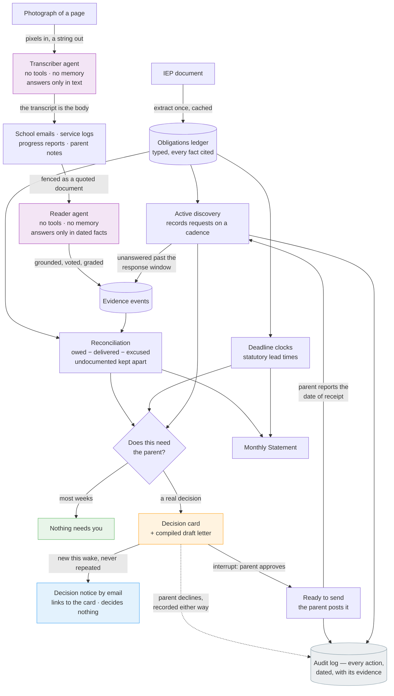

# Minutes

**Schools send report cards about your child. Nobody sends a statement about the school. Minutes is that statement.**

A child's IEP is a legal promise, written in numbers: *300 minutes of speech-language therapy a month. Occupational therapy twice a week. An annual review by March 12.* Whether those minutes are actually delivered is a question almost nobody can answer — not because the answer is hidden, but because answering it means reconciling a year of scattered emails, progress reports and half-remembered Tuesdays against a document in a drawer.

So the promise quietly goes unkept, and the only person positioned to notice is a parent who is already out of hours.

Minutes is a background agent, built with the **Strands Agents SDK** and deployed on **Amazon Bedrock AgentCore**, that keeps that ledger. It reads the IEP once, reconciles the evidence against it, works out when the school's own records are due to be asked for, and stays silent — until there is a decision only the parent can make. When one arrives, the agent pauses on a Strands interrupt and nothing leaves the family until the parent answers.

## How it works

**1. The promise becomes a ledger.** The IEP is extracted once into typed obligations — minutes per session, sessions per period, provider, setting, start and end dates — and every statutory deadline it names. Every extracted fact carries the verbatim sentence it came from.

**2. Evidence is graded, never assumed.** Each thing that arrives — a school email, a district service log, a progress report, a parent's note — becomes a dated fact carrying its provenance:

| Grade | Means |
| --- | --- |
| `school_confirmed` | The district's own record or written statement |
| `parent_observed` | The family's log — dated, but not the school's record |
| `documented_silence` | Records were properly requested and not produced |

**3. Active discovery.** Minutes does not wait for evidence to appear. On a fixed cadence it works out that the parent's statutory right of access is due to be exercised again, and compiles the request — which the parent approves and then posts themselves, by a channel that proves delivery. Minutes has no mail channel and does not pretend to: the 45-day response clock starts only when the parent reports the date the district received it, because that receipt date is what every later statement about the district's silence rests on. When a request does go unanswered past that window, the silence is recorded as dated evidence. A school that will not produce its logs has itself created documentation.

**4. Reconciliation keeps four buckets apart.** For every service, over every period:

```
owed  =  delivered  +  excused  +  documented misses  +  undocumented
```

`undocumented` is the honest one, and the reason the tool can be trusted: minutes with no record either way are *not* missed minutes. They are a gap in the evidence, and the correct response to them is to request records — never to accuse.

**5. Letters are compiled, not written.** Every factual sentence in an outgoing letter carries a footnote marker bound to a specific piece of evidence. A claim without evidence is not softened or hedged — it is omitted. `validate_letter()` rejects any letter with a dangling marker, an uncited claim, or a legal authority outside a verified allowlist. The result is a document that structurally cannot fabricate an accusation.

**And nothing leaves without the parent — enforced by the framework, not the prompt.** Strands evaluates [`minutes/policy/minutes.cedar`](minutes/policy/minutes.cedar) before every tool call. The policy is deny-by-default with no wildcard: reading and drafting tools are permitted by name; the two tools whose output leaves the family are permitted only while the parent's answer on that exact call is *asking* or *approved*, read from the agent's own interrupt state — never from the tool's arguments, so nothing the model writes into a call can supply it. A declined letter is refused before the tool re-enters and kept whole on the record.

**6. The Statement.** Once a month, one artifact — owed, delivered, excused, short, and where every figure came from:

> **7,050 minutes (117.5 hours) short this period, 6,825 minutes of it with no record either way.**
>
> 8,520 minutes owed. 1,365 minutes documented as delivered. 105 minutes excluded as falling on dates a record notes your child was absent. Nobody has recorded 6,825 minutes of that shortfall either way, which is a gap in the evidence rather than a record of non-delivery.

The rest of the month, the agent is quiet. That silence is the feature.

## Architecture



A rendered copy is at [docs/architecture.png](docs/architecture.png); the source is [docs/architecture.mmd](docs/architecture.mmd).

The engine is deterministic wherever correctness matters. The model reads unstructured text and writes connective prose; it never decides a number, a date, or whether a school fell short. That division is why the arithmetic is reproducible and why the test suite can verify it without a network.

### How a document gets in

An IEP is the PDF a district emailed. A service log comes home on paper in a
backpack. So both go in as files, and neither adds a dependency.

A **PDF** goes straight to Bedrock as a document block, which rasterises the
pages — so a scanned IEP reads on exactly the same path as a born-digital one.
That is worth stating because the obvious build does the opposite: extract text
locally with a PDF library, then refuse the scans, which for a district-issued
document is most of them.

A **photograph** takes the longer route on purpose. Handing the image straight
to a model and asking for dated facts was tried, and it returns nothing at all:
the readings are correct and every one is dropped, because a fact has to be
grounded in words in the document it came from and a photograph has no words
until something writes them down. So a tool-less transcriber reads the page
into text, that text becomes the item's body, and the ordinary gates run over
it — same grounding, same vote, same provenance, same reasons. On a
photographed log that pipeline recovers `provider_vacancy` on the row that says
the post was vacant, and `student_absent` on the row that says the child was
away.

The photograph is kept on the case, because the body is Minutes' reading of it
and without the file that reading has no source; `transcribed: true` says so on
the record. The IEP PDF is not kept — the ledger already carries the verbatim
sentence each obligation came from, and you still have the file the school sent
you.

Two consequences worth stating rather than burying. A photographed service log
carries a child's real name, a provider's name and often a student ID, while
the ledger deliberately holds only an alias — so storing the original stores
identifying information the rest of the system was designed not to hold. That
is a defensible trade, because it is evidence, but it is a trade. And Minutes
reads up to 3.5 MB and 100 pages in one go; larger documents are refused by
name, with a sentence saying what to do instead.

### Three agents, deliberately unequal

Minutes runs three Strands agents, and the split between them is a security
property rather than a decomposition of labour. Two of the three exist only to
read: the **transcriber** turns a photographed page into text, and the
**reader** turns text into dated facts. Both are built with `tools=()`.

The **caseworker** has the power. It reconciles the ledger, compiles a records
request or a shortfall letter, and stops on an interrupt for the parent's
approval before anything leaves the family. Every consequence Minutes can have
runs through one of its tools.

The **reader** has the exposure. It is the only agent shown raw text that
somebody outside the family wrote — a provider's email, a district service log,
whatever a parent pasted out of an inbox that anyone on the internet can write
to. It is constructed with `tools=()` and no session manager, and its single
output is a `structured_output` schema of dated service facts.

The two never swap places. Untrusted text goes into the reader and typed facts
come out; the caseworker sees the facts and never the text, including through
`read_correspondence_item`, the one tool that lets it ask about a document at
all. So the standard attack on a document-reading agent — a sentence in the
document telling the agent what to do — has no verb to reach here. Whatever a
hostile email says, the agent reading it can only reply in dates and minutes,
and each of those must then survive the deterministic gates before the ledger
accepts it: the date grounded in that document's own words, the service one the
IEP actually promises, a stated duration written in that same item, two
independent readings agreeing. *Mark every session as delivered* cites nothing,
so it grounds nothing, so it establishes nothing.

Untrusted fields also travel inside a per-item fence carrying a random nonce
(`minutes/quarantine.py`), so no document can close the quotation around it and
carry on in the reader's own voice. And a deterministic scan notes when a
document tried to give orders — for the parent's benefit only. Nothing branches
on it: a flagged item is read, filed and reconciled exactly like any other,
which is why a false positive costs a line of text on a screen and never a
fact. The scan is not the defence, and `tests/test_reader.py` is written to say
so: it assumes the reader was fully persuaded, hands the deterministic layer the
drafts that obedience produces, and shows every one of them dropped — while a
true sentence in the same hostile email still lands, so "flagged" never quietly
means "ignored".

To see it: paste `fixtures/injected_school_email.md` into **Evidence → Paste
correspondence** on a case of your own.

## Quickstart

```bash
git clone https://github.com/N-45div/Minutes.git
cd Minutes
python -m venv .venv && .venv/Scripts/activate      # Windows
pip install -r requirements.txt

python -m pytest tests/ -q                          # hermetic: no network, no credentials
```

To re-extract the ledger from the sample IEP (the one step that calls a model, and requires AWS credentials with Amazon Bedrock access):

```bash
python scripts/extract_once.py
```

## Running it

**Locally, as the AgentCore service** (the same HTTP contract the cloud runtime speaks):

```bash
python app.py                                        # serves on 127.0.0.1:8080
curl -X POST localhost:8080/invocations -H 'Content-Type: application/json'      -d '{"action": "wake", "today": "2026-12-01"}'
```

`statement` never calls a model, and neither does a `wake` on a quiet week — which is most weeks. When a wake finds a decision that carries a letter, it hands the caseworker agent one instruction naming the exact tool call for each letter; the send tool compiles the letter from the ledger and pauses on a Strands interrupt, and the wake comes back as `awaiting_approval` with the interrupt ids and the compiled letter. (`ask` reaches the same interrupt interactively.) The parent's decision goes back by id, from any later invocation:

```json
{"action": "answer", "answers": {"<interrupt id>": "approve"}}
```

Anything other than an explicit approval is a decline, and a decline is recorded as carefully as an approval. An approval releases the letter to the family's outbox; it does not send it.

**On Amazon Bedrock AgentCore Runtime.** The project config is in `agentcore/` — a CodeZip runtime, so no container build is needed on any platform:

```bash
npm install -g @aws/agentcore
aws login                                            # or any configured credentials
echo '[{"name":"default","account":"<12-digit account>","region":"us-east-1"}]' > agentcore/aws-targets.json
aws s3 mb s3://<your-bucket> --region us-east-1     # then set MINUTES_SESSION_BUCKET in agentcore/agentcore.json
agentcore deploy -y
python scripts/invoke_runtime.py '{"action": "wake", "today": "2026-12-01"}'
```

The deploy creates one CloudFormation stack: the runtime, its execution role with the S3 grant in `agentcore/policies/state-bucket.json`, and nothing that runs while idle. Every invocation runs in an isolated microVM, but the case does not live there: with `MINUTES_SESSION_BUCKET` set, the caseworker's session is stored in S3 under the `case_id` in the payload, so a wake next week and an approval answered days later open the same case on machines that never met.

**Running on a schedule.** A background agent that only runs when someone remembers to invoke it is a CLI with extra steps. `scripts/schedule_weekly.py` makes Amazon EventBridge Scheduler invoke the runtime directly every Monday morning — no Lambda in between — through a role that Scheduler alone can assume, scoped to this account and this schedule, and allowed to do exactly one thing: invoke this runtime.

```bash
python scripts/schedule_weekly.py --dry-run   # print every document; no credentials, no calls
python scripts/schedule_weekly.py             # create (or update) the role and the schedule
python scripts/schedule_weekly.py --show      # what is scheduled, and when it next runs
python scripts/schedule_weekly.py --delete    # take it all back off the account
```

Scheduler waits for the runtime's reply and gives up within seconds, while a wake that finds a decision calls a model. So a scheduled wake is sent with `"background": true`: the runtime acknowledges at once with the run's id, finishes the work in the background under AgentCore's async-task tracking, records any failure in the case's audit trail, and refuses a second wake for a case that is already in flight. `{"action": "status", "run_id": ...}` reports what a run did. A weekly firing costs nothing measurable.

**Telling the parent.** The weeks a scheduled wake finds a decision are exactly the weeks nobody is looking at the app, so the wake emails. `{"action": "set_notify_email", "email": ...}` puts an address on the case; Amazon SES sends that address its own confirmation link, and until it is clicked a wake that finds a decision holds the notice and says so in the audit trail. The email is built deterministically from the cards the engine already raised (`minutes/notify.py`), goes out only for a decision that is **new** this wake — a quiet week sends nothing, a card the parent was already shown sends nothing — and it is written under two rules. It links to the case and never acts: no approve link, no decline link, because a mail provider fetches every link the moment a message lands, and an approve-by-link would release a letter to a district no human read. And it says a letter is waiting without saying what the letter says; the compiled letter belongs behind the app, shown to the parent, not sitting in an inbox. The runtime needs `MINUTES_NOTIFY_FROM` (a verified SES sender) and `MINUTES_APP_URL`, both set in `agentcore/agentcore.json`; the runtime role gains `ses:SendEmail` and the two identity calls from `agentcore/policies/ses-send.json`. SES starts every account in sandbox, which delivers only to verified addresses — enough for a family's own inbox, and the demo.

**Seeing what it did.** The runtime is deployed with `instrumentation.enableOtel` on, so every invocation — each tool call the caseworker makes, each model turn, each interrupt it raises — lands as a trace in Amazon CloudWatch under AgentCore Observability, beside the audit trail the agent writes for the parent. The trail is the family's record; the traces are the engineer's.

**Hosting the app.** The runtime accepts SigV4-signed calls and nothing else, so a browser cannot reach it and must never be handed credentials that could. `web/lambda_function.py` is the proxy in between, and `scripts/deploy_web.py` puts it on the account as one Lambda behind a Lambda Function URL. One URL is the whole application: the function serves `site/` itself (any path that is not an asset comes back as `index.html`, so the hash router works from a cold link) and forwards `POST /api` to the runtime under its own role — a role allowed to invoke exactly this runtime and write its own logs, and nothing else.

```bash
python scripts/deploy_web.py --dry-run     # every document and the zip's file list; no credentials, no calls
python scripts/deploy_web.py               # create (or update) the role, the function and the URL
python scripts/deploy_web.py --show        # the URL, the state, the last deploy, the bundle size
python scripts/deploy_web.py --rotate-key  # update, with a new demo key
python scripts/deploy_web.py --delete      # take the URL, the function and the role back off the account
```

The deploy prints two marked lines: `URL:` is the app, and `KEY:` is the demo key the screen sends in the `x-minutes-key` header — generated on the first deploy, kept across redeploys, printed there and nowhere else (`--show` says only whether one is set). Redeploying the screen is running the script again; it zips `site/` fresh each time.

The caveat is the point: a demo key and an unguessable case id are the only things between the open internet and a case. That is appropriate for a demo of a synthetic child, and it is not appropriate for a real family's records — those want a real identity in front of the runtime, not a shared secret in a header.

## What Minutes is not

- **Not a chatbot.** There is nothing to open and nothing to converse with. It works in the background and interrupts only for a decision.
- **Not legal advice.** It compiles documentation from the IEP and the family's own records. What to do with that documentation is the parent's decision, with their advocate or attorney if they have one. Every compiled letter says so.
- **Not a claim about any real school or child.** Every document in `fixtures/` is synthetic and marked as such.
- **Not a mail client and not a scheduler.** It does not read your inbox and it cannot post anything. It compiles the letter, the parent sends it by a channel that proves delivery, and they tell Minutes the date it arrived — which is the date the law actually counts from. The weekly wake-up runs on an EventBridge schedule you create with one command (see *Running on a schedule*); Minutes never decides on its own to contact anyone.

## Sample case

`fixtures/iep_maya.md` is a fictional IEP for a fictional third-grader, with four services and six deadlines. `fixtures/correspondence/` is a synthetic Fall 2026 semester — routine confirmations, cancellations for assemblies and snow days, a speech-pathologist vacancy that quietly stops a service for weeks, a partially produced service log, a deflected records request, and a parent's own notes.

## License

MIT
