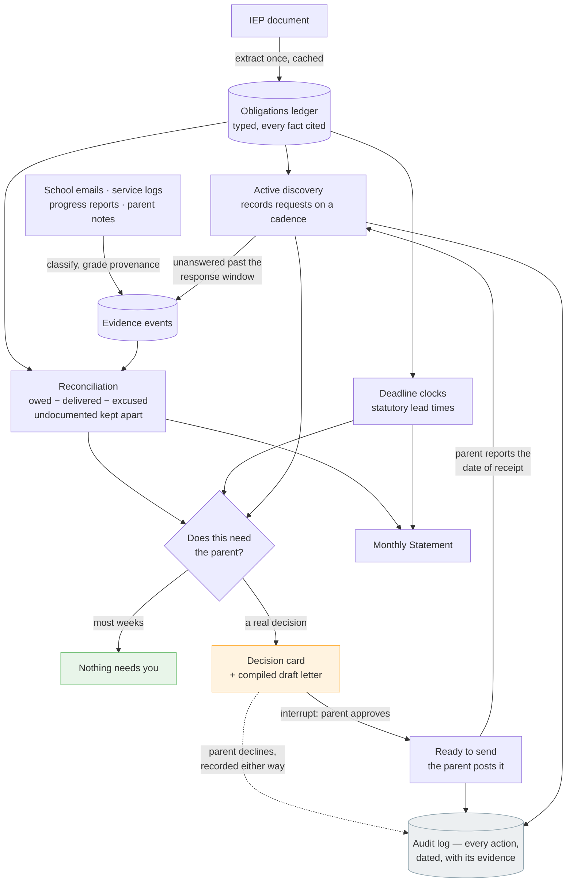

# Minutes

**Schools send report cards about your child. Nobody sends a statement about the school. Minutes is that statement.**

A child's IEP is a legal promise, written in numbers: *300 minutes of speech-language therapy a month. Occupational therapy twice a week. An annual review by March 12.* Whether those minutes are actually delivered is a question almost nobody can answer — not because the answer is hidden, but because answering it means reconciling a year of scattered emails, progress reports and half-remembered Tuesdays against a document in a drawer.

So the promise quietly goes unkept, and the only person positioned to notice is a parent who is already out of hours.

Minutes is a background agent that keeps that ledger. It reads the IEP once, reconciles the evidence against it, works out when the school's own records are due to be asked for, and stays silent — until there is a decision only the parent can make.

## How it works

**1. The promise becomes a ledger.** The IEP is extracted once into typed obligations — minutes per session, sessions per period, provider, setting, start and end dates — and every statutory deadline it names. Every extracted fact carries the verbatim sentence it came from.

**2. Evidence is graded, never assumed.** Each thing that arrives — a school email, a district service log, a progress report, a parent's note — becomes a dated fact carrying its provenance:

| Grade | Means |
| --- | --- |
| `school_confirmed` | The district's own record or written statement |
| `parent_observed` | The family's log — dated, but not the school's record |
| `documented_silence` | Records were properly requested and not produced |

**3. Active discovery.** Minutes does not wait for evidence to appear. On a fixed cadence it works out that the parent's statutory right of access is due to be exercised again, and compiles the request — which the parent approves and then posts themselves, by a channel that proves delivery. Minutes has no mail channel and does not pretend to: the 45-day response clock starts only when the parent reports the date the district received it, because that receipt date is what every later statement about the district's silence rests on. When a request does go unanswered past that window, the silence is recorded as dated evidence. A school that will not produce its logs has itself created documentation.

**4. Reconciliation keeps four buckets apart.** For every service, over every period:

```
owed  =  delivered  +  excused  +  documented misses  +  undocumented
```

`undocumented` is the honest one, and the reason the tool can be trusted: minutes with no record either way are *not* missed minutes. They are a gap in the evidence, and the correct response to them is to request records — never to accuse.

**5. Letters are compiled, not written.** Every factual sentence in an outgoing letter carries a footnote marker bound to a specific piece of evidence. A claim without evidence is not softened or hedged — it is omitted. `validate_letter()` rejects any letter with a dangling marker, an uncited claim, or a legal authority outside a verified allowlist. The result is a document that structurally cannot fabricate an accusation.

**6. The Statement.** Once a month, one artifact — owed, delivered, excused, short, and where every figure came from:

> **7,050 minutes (117.5 hours) short this period, 7,020 minutes of it with no record either way.**
>
> 8,520 minutes owed. 1,365 minutes documented as delivered. 105 minutes excluded as falling on dates a record notes your child was absent. Nobody has recorded 7,020 minutes of that shortfall either way, which is a gap in the evidence rather than a record of non-delivery.

The rest of the month, the agent is quiet. That silence is the feature.

## Architecture



The engine is deterministic wherever correctness matters. The model reads unstructured text and writes connective prose; it never decides a number, a date, or whether a school fell short. That division is why the arithmetic is reproducible and why the test suite can verify it without a network.

## Quickstart

```bash
git clone https://github.com/N-45div/Minutes.git
cd Minutes
python -m venv .venv && .venv/Scripts/activate      # Windows
pip install -r requirements.txt

python -m pytest tests/ -q                          # hermetic: no network, no credentials
```

To re-extract the ledger from the sample IEP (the one step that calls a model, and requires AWS credentials with Amazon Bedrock access):

```bash
python scripts/extract_once.py
```

## Running it

**Locally, as the AgentCore service** (the same HTTP contract the cloud runtime speaks):

```bash
python app.py                                        # serves on 127.0.0.1:8080
curl -X POST localhost:8080/invocations -H 'Content-Type: application/json'      -d '{"action": "wake", "today": "2026-12-01"}'
```

`wake` and `statement` never call a model. `ask` runs the caseworker agent; when it reaches a step that would put a letter in front of the school, it pauses on a Strands interrupt and the response comes back as `awaiting_approval` with the interrupt ids and the compiled letter. The parent's decision goes back by id:

```json
{"action": "answer", "answers": {"<interrupt id>": "approve"}}
```

Anything other than an explicit approval is a decline, and a decline is recorded as carefully as an approval. An approval releases the letter to the family's outbox; it does not send it.

**On Amazon Bedrock AgentCore Runtime.** The project config is in `agentcore/` — a CodeZip runtime, so no container build is needed on any platform:

```bash
npm install -g @aws/agentcore
aws login                                            # or any configured credentials
echo '[{"name":"default","account":"<12-digit account>","region":"us-east-1"}]' > agentcore/aws-targets.json
agentcore deploy -y
python scripts/invoke_runtime.py '{"action": "wake", "today": "2026-12-01"}'
```

The deploy creates one CloudFormation stack: the runtime, its execution role, and nothing that runs while idle. Every session is its own isolated microVM, and the session id carries the case from one invocation to the next.

## What Minutes is not

- **Not a chatbot.** There is nothing to open and nothing to converse with. It works in the background and interrupts only for a decision.
- **Not legal advice.** It compiles documentation from the IEP and the family's own records. What to do with that documentation is the parent's decision, with their advocate or attorney if they have one. Every compiled letter says so.
- **Not a claim about any real school or child.** Every document in `fixtures/` is synthetic and marked as such.
- **Not a mail client and not a scheduler.** It does not read your inbox and it cannot post anything. It compiles the letter, the parent sends it by a channel that proves delivery, and they tell Minutes the date it arrived — which is the date the law actually counts from. The weekly wake-up is a function something external calls; no scheduler ships in this repo.

## Sample case

`fixtures/iep_maya.md` is a fictional IEP for a fictional third-grader, with four services and six deadlines. `fixtures/correspondence/` is a synthetic Fall 2026 semester — routine confirmations, cancellations for assemblies and snow days, a speech-pathologist vacancy that quietly stops a service for weeks, a partially produced service log, a deflected records request, and a parent's own notes.

## License

MIT
